# telegram-runpod-serverless
## Deploy Runpod Serverless Endpoint 
- Firstly you need to clone this repository: 
```
git clone git@github.com:khang-nguyen2907/telegram-runpod-serverless.git
cd telegram-runpod-serverless
```
### 1. Build Docker Image
#### Dockerfile Explanation
- Runpod serverless endpoint will base on your docker image as the working environment 
- Everything is setup is in `Dockerfile`
    - From line 1 to line 21 is regular setup environment 
    - Line 22 and 23: create working directory or root. For example, Linux has its root directory is `/root`, now your docker environment (is also ubuntu) has its root directory is `/data`
    - Line 25 and 26: We copy the `requirements.txt` file from this repository to our docker image and run to install all dependencies (libraries)
    - Line 28: copy the `handler.py` from this repository to docker image. In `handler.py`, model is initialized, the `inference()` function will take request from user, extract the message, then put to the model in order that model can respond and return responses back to the user. 
    - From line 31 to line 35: We initialize environment variables. **Please modify with your own information**: 
        - `MODEL_NAME`: name of the model you want to download from huggingface hub. For example, `mistralai/Mistral-7B-Instruct-v0.1` or your model on huggingface hub after finetuning
        - `MODEL_REPO`: The directory that will store all things of the model after downloading including checkpoint, config, ... 
        - `HUGGING_FACE_HUB_TOKEN`: Your access token in order to download your private model
        - `HUGGINGFACE_HUB_CACHE`: cache dir. We don't care about this. This variable just work in case you create a volumne on runpod but it is very expensive
        - `TRANSFORMERS_CACHE`: cache dir. We don't care about this. This variable just work in case you create a volumne on runpod but it is very expensive
    - Line 37: we create model directory to hold model's checkpoint 
    - Line 38: we download model from huggingface hub and save to `MODEL_REPO`. We need to download the model checkpoint manually and save it to docker image. We don't regularly use `.from_pretrained(MODEL_NAME)` because Mistral-7B's checkpoint is up to 15gb. It takes a lot of time to download every serverless endpoint starts. It is expensive and let user down because of high latency (waiting for model respond too long)
    - Line 40 is to run the `handler.py` file when we start the container. 

#### Build 
- Make sure you have docker installed on your local machine 
- Create a dockerhub account on [Dockerhub](https://hub.docker.com/)
- First you need to login, let open the terminal and type: 
```
docker login
```
- username is your dockerhub's username
- password is your access token. To get access token, you login to your  dockerhub 
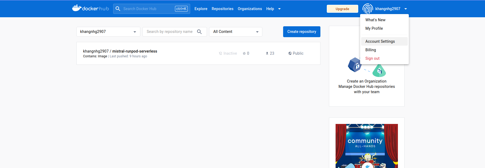
go to Security and create new access token: 
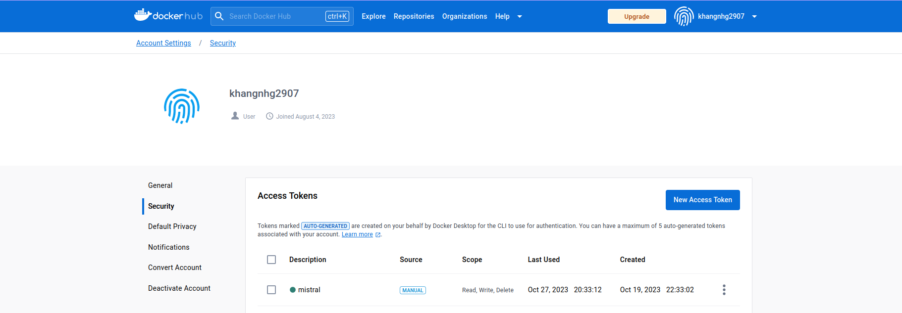    
- After login successfully, make sure you are standing at `telegram-runpod-serverless` directory on terminal. Then, build the docker image by running: 
```
docker build . --file Dockerfile --tag <username>/telegram-runpod-serverless:latest
```
Change the `<username>` in the above running script by your dockerhub'username. For example, my dockerhub username is `khangnhg2907`, therefore, my running script is `docker build . --file Dockerfile --tag khangnhg2907/telegram-runpod-serverless:latest`. Afte building successfully: 
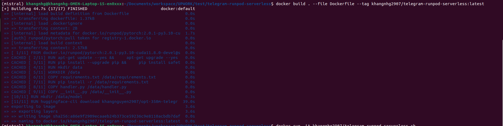
- you can check whether your image exists: 
```
docker images -a
```
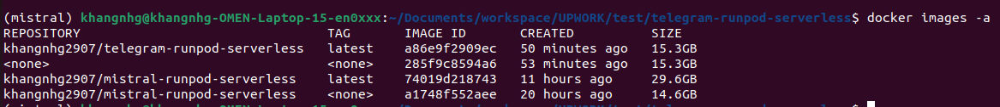
- Here, `khangnhg2907/telegram-runpod-serverless:latest` exists 
#### Push Docker image to dockerhub
```
docker push <username>/telegram-runpod-serverless:latest
```
- Remember to replace `<username>` by your username and wait for a while
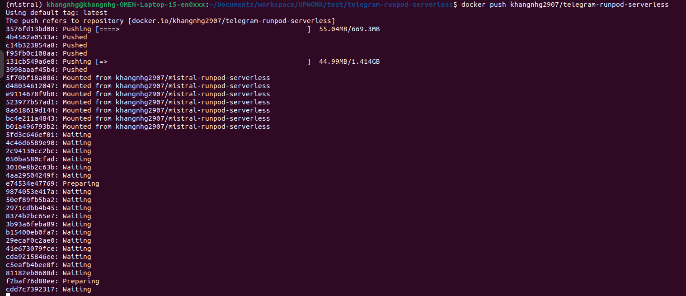
- After pushing, let's check, the docker image now exists on your docker hub: 
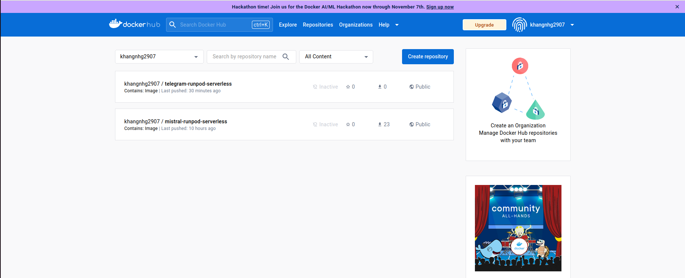

### 2. Create Serverless Rundpod Endpoint 
- In your Runpod account, choose **Serverless** -> **Custom Templates** -> **New Template**
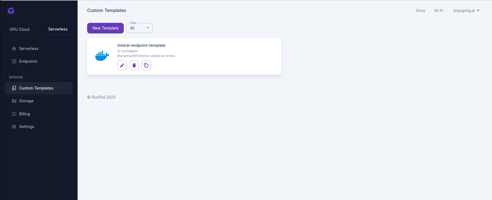
- Name your template. At **Container Image**, pass your docker image that you have just pushed to dockerhub. Initalize **Container Disk** with 50 GB and click **Save Template**
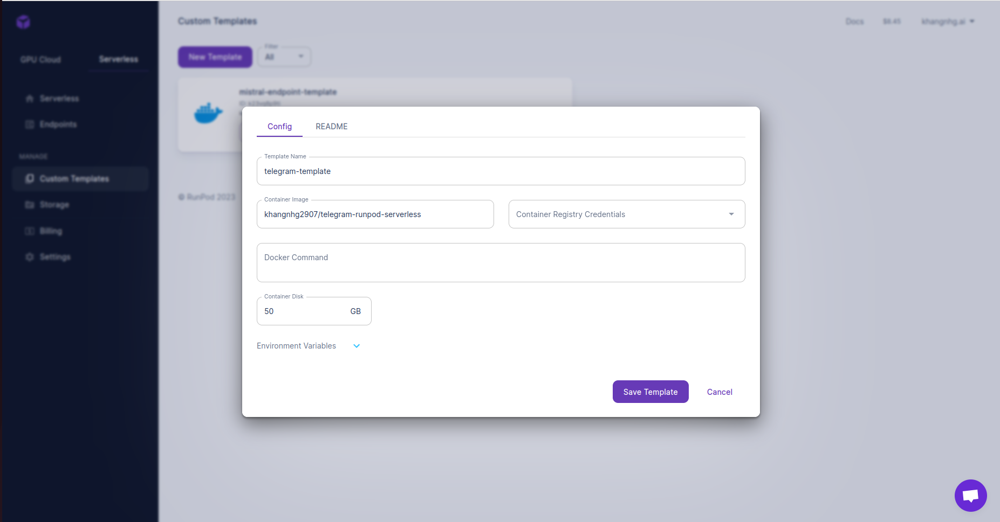

### 3. Create Serverless Endpoint 
- Go to **Serverless** -> **Endpoint** -> **New Endpoint**
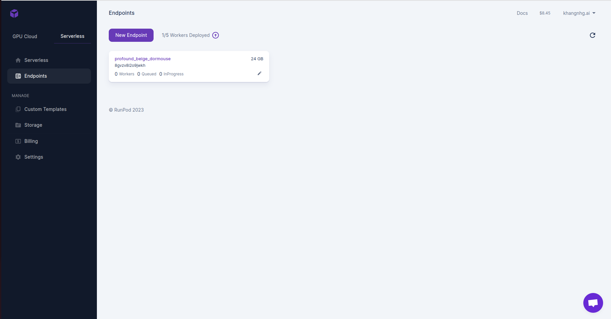
- Setup your serverless endpoint. Name your endpoint. At **Select Template**, let's select the template that you have just created in previous step. Setup number of workers, idle timeout and choose GPU. Finally click **Deploy**
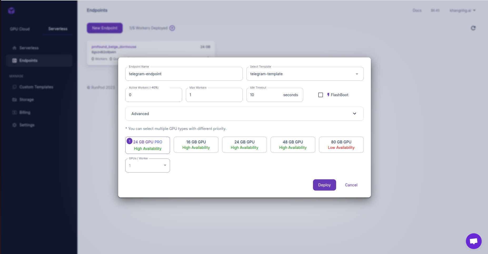
- After clicking **Deploy**, wait for minutes in order that the endpoint is initialized, it will pull the docker image from dockerhub. You can see the blue tag `Initializing`
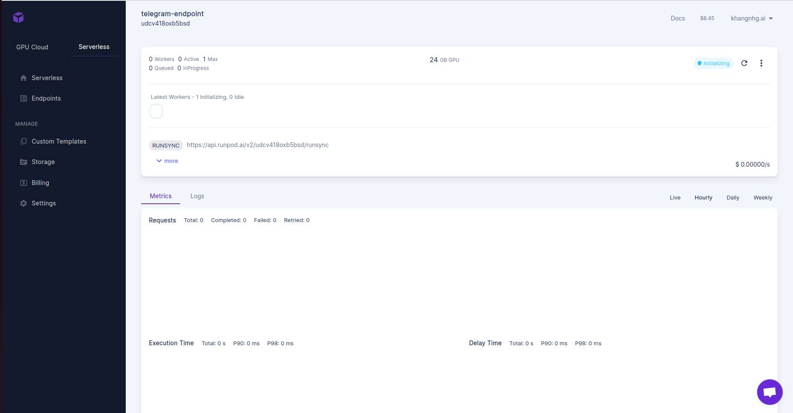
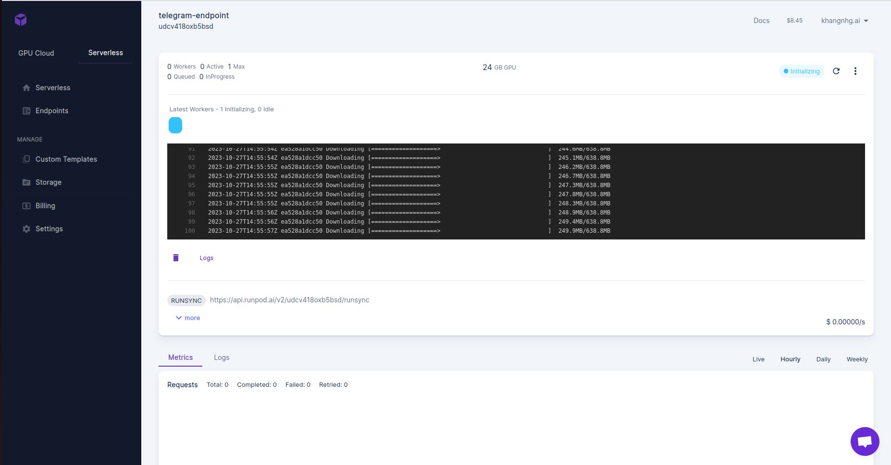
- When initializing is done, the green tag `Ready` appears and now you can send the request: 

- Below the Endpoint name (on the top of the screen) is the endpoint ID, just save it

### 4. Test the endpoint 
- Open Postman, drag the `serverless_api_postman_collection.json` file to the **Collections** space
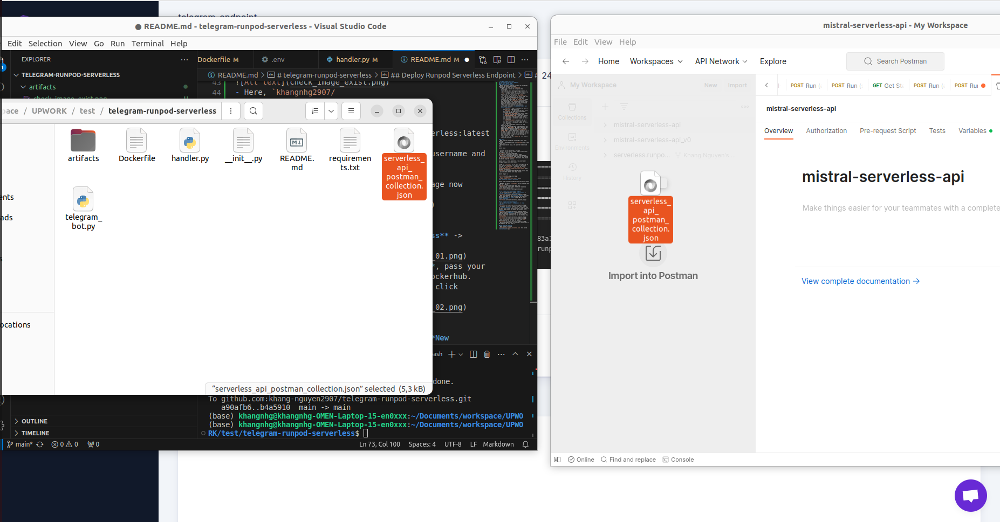
- Now you have place to test. At **Variables** tab, provide **api_key** which you can get from runpod account. Then provide **serverless_api_id** is the endpoint ID which is below the Endpoint name mentioned in previous step
- *NOTE: remember to click save*
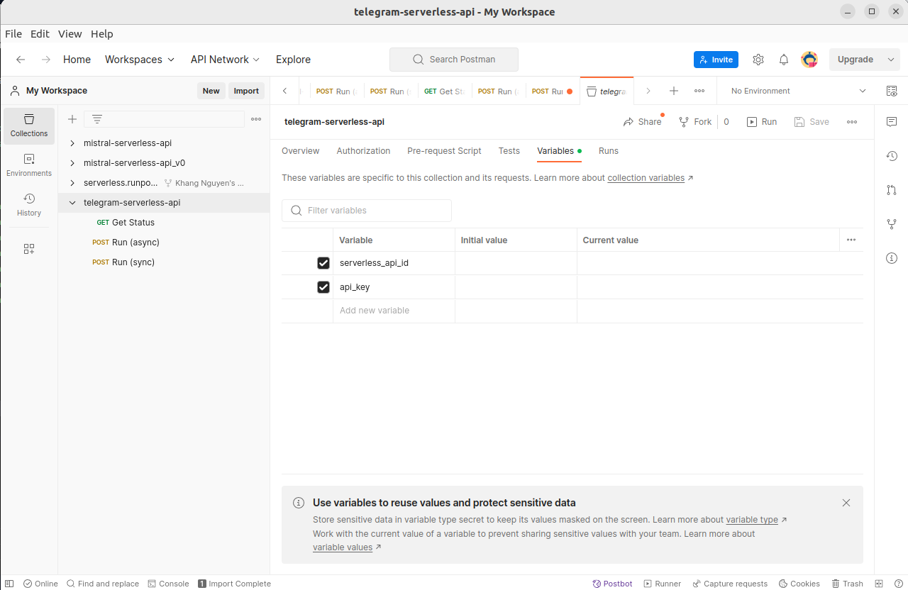
- Now you can run sync **Run (sync)** or async **Run (async)**. Whatever you choose to run, your input is in **raw** tab. Then click **Send**
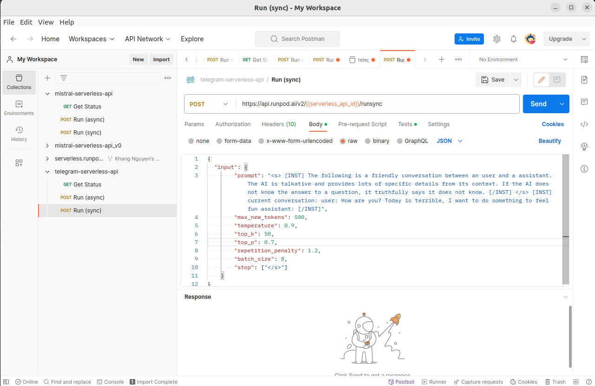
- After sending, your Serverless Endpoint will run and return the output. You also track your serverless on the web, in the logs  
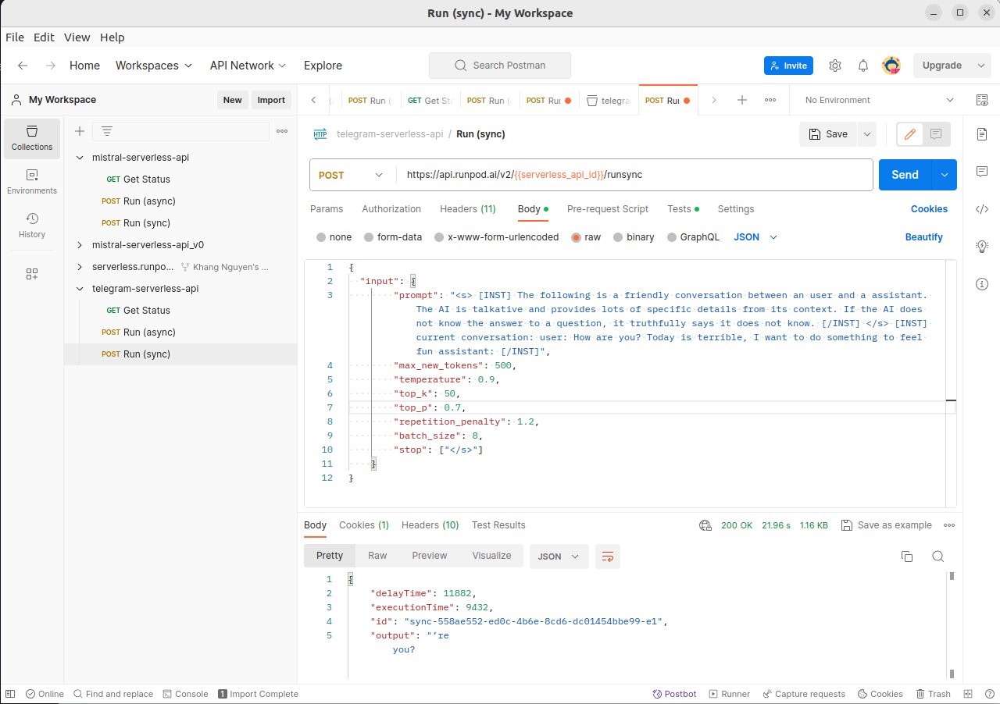
- After returning the output, the worker will stop. 

## Run Telegram bot 
- Telegram bot will be run on your local machine or any machine but we need to setup environment. We should use anaconda: 
```
conda create -n telegram python=3.10 -y
conda activate telegram 
pip install runpod python-telegram-bot runpod langchain python-dotenv
```
- After that, you go to `.env` file to fill up the variable environment: 
    - `TELEGRAM_TOKEN`: HTTP Access token which you get after creating a bot on telegram
    - `BOT_USERNAME`: username of your bot
    - `RUNPOD_API_KEY`: your Runpod Access Token 
    - `ENDPOINT_ID`: Endpoint ID that is hosting the LLM 
- Run the bot: 
```
python telegram_bot.py
```
- After sending a message, you can check whether your serverless is running on it interface (web) and see the logs 
